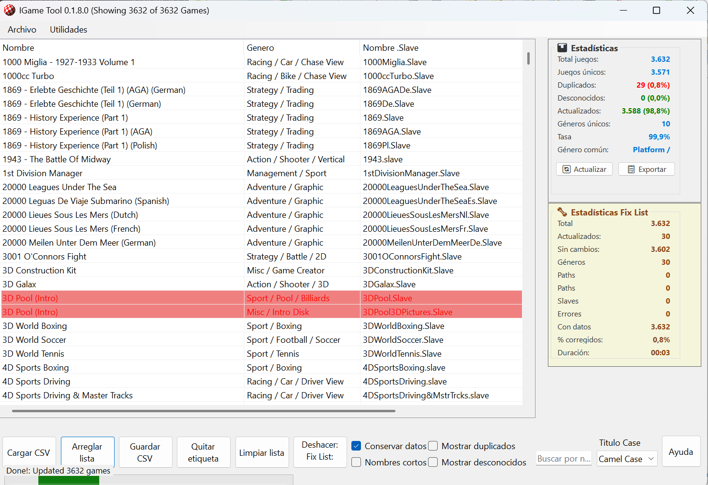

# IgameToolsWinForms

Aplicación Windows Forms (.NET 8) para abrir y visualizar `csv/gameslist.csv` (formato IGame) con una interfaz similar a la herramienta original.

## Capturas

Las capturas se guardan en `img/`.

- **Pantalla principal**

  

## Requisitos

- Visual Studio 2022
- .NET 8 SDK

## Ejecutar

1. Abre `IgameToolsWinForms/IgameToolsWinForms.csproj` en Visual Studio.
2. Ejecuta el proyecto.

Al iniciar no carga ningún archivo automáticamente. Usa el botón **Load CSV** para seleccionar un archivo `gameslist.csv`.

## Funcionalidad actual

- **Load CSV**: carga un `gameslist.csv` y muestra columnas `Name`, `Genre`, `Slave`, `Path`.
- **Short Names**: alterna entre nombre completo y nombre corto (31 caracteres, truncación inteligente en límites de palabras).
- **Title Case**: previsualiza el texto con `Camel Case`, `lower case` o `UPPER CASE`.
- **Show Dupes**: filtra para mostrar solo nombres duplicados (se resaltan en rojo).
- **Show Unknown**: filtra para mostrar solo juegos no encontrados en la Fix List (se muestran en azul).
- **Save CSV**: guarda el CSV con el mismo formato base del original (sobrescribir o guardar como nuevo) y respeta `Short Names`, `Keep Data` y `Title Case`.
- **Quick Tag**: añade `(tag)` al final del nombre en los juegos seleccionados.
- **Undo/Redo**: sistema completo con historial de 50 comandos, atajos Ctrl+Z/Ctrl+Y.
- **Edición**: doble click sobre un juego para editar `Name`, `Short`, `Slave` y `Genre`.
- **Fix List**: descarga (si hace falta) el archivo `IG_Data*` y `genres` desde FTP y actualiza `Name/Short/Genre`. Los juegos no encontrados se marcan como `Unknown` (en azul) y se pueden filtrar con **Show Unknown**. Durante el proceso se muestra una ventana de estado y al finalizar presenta un resumen detallado con estadísticas de actualización.
- **Estadísticas**: panel de estadísticas en tiempo real con información general y de Fix List, capacidad de exportar al portapapeles.
- **Búsqueda Avanzada**: búsqueda avanzada con múltiples filtros y atajos (Ctrl+F).
- **WHDLoad Tools**: herramienta integrada para descargar y gestionar archivos WHDLoad (juegos de Amiga) desde servidores FTP/HTTP con filtrado avanzado, vista previa de descargas y organización de carpetas. La ventana de descarga muestra el árbol por categorías (Games/Demos/Beta/Magazines), permite seleccionar qué descargar y exportar la selección a TXT sin bloquear la interfaz. Utiliza orden alfabético por defecto (Sorting=Alphabetical).
- **WHDLoad Tools (Prefs/Filtros)**: `default.prefs` usa formato INI compatible con el original (`[FTP]`, `[Paths]`, `[Filter]` y claves `Filter_*`). La UI de filtros está organizada por `System`, `Chipset`, `Sound` y `Language`.
- **Interfaz Responsiva**: layout optimizado sin solapamientos, ajuste automático al redimensionar ventana.

Origen FTP actual: `ftp://ftp.grandis.nu/~Uploads/mrv2k/`.

## Características Técnicas

- **Sistema de Comandos**: Implementación del patrón Command para acciones deshacibles
- **Validación CSV**: Validación robusta de archivos CSV con detección de errores
- **FTP Integrado**: Conexión segura con manejo de timeouts y reintentos
- **Interfaz Responsiva**: Layout optimizado con ajuste dinámico y sin solapamientos
- **Persistencia**: Guardado automático de preferencias y archivos recientes
- **Estadísticas en Tiempo Real**: Cálculo y visualización de estadísticas generales y de Fix List
- **WHDLoad Integration**: Sistema completo para gestión de archivos WHDLoad con soporte HTTP/FTP
- **Búsqueda Avanzada**: Sistema de búsqueda con múltiples filtros y expresiones regulares
- **Sistema de Progreso Integrado**: Barra de progreso principal para operaciones largas (cargar, guardar, Fix List)

## Créditos

Esta aplicación está inspirada en la herramienta original **I-Game Tool**.

- Autor original: **Paul Vince (MrV2k)**
- © 2022 Paul Vince (MrV2k)
- Referencia: `original/IGame_Tool07a.pb`
- Web: <https://github.com/MrV2K/IG_Tool>

## Estado Actual

Versión estable con funcionalidad completa. La aplicación incluye todas las características principales de la herramienta original más mejoras adicionales como:

- Interfaz moderna y responsiva
- Panel de estadísticas en tiempo real
- Búsqueda avanzada con múltiples filtros
- Sistema de undo/redo robusto
- Manejo mejorado de errores
- Soporte para archivos CSV grandes

## Issues Conocidos

- #20 Diálogos de Confirmación del Original
- #22 Manejo Mejorado de Errores del Original  
- #23 Comportamiento UI Exacto del Original
